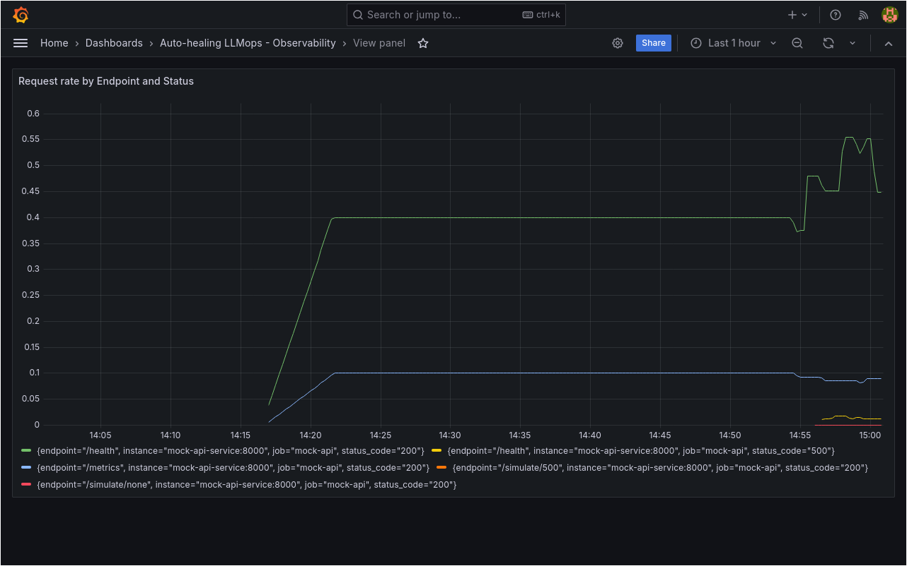

# Auto-healing LLMops

A Kubernetes-native, self-healing deployment pipeline for an LLM inference 
service, with Prometheus/Grafana observability and a custom healing layer 
(in progress). Built and tested entirely locally on constrained hardware 
(ThinkPad T410, 1st-gen i5, 4GB RAM, spinning disk) - no cloud dependency.

The LLM inference service is the workload under management; the project's 
focus is the surrounding DevOps/observability/self-healing tooling.

## Architecture

FastAPI mock inference service -> Docker -> k3s (single-node) -> 
Prometheus + Grafana -> custom healing/escalation layer (Stage 5) -> 
real Ollama-served model (Stage 6)

## Local Environment Setup

- 4GB swapfile added and persisted via `/etc/fstab`, since 4GB RAM alone 
  isn't enough headroom to run k3s plus multiple workload pods.
- k3s installed with Traefik and ServiceLB disabled 
  (`/etc/rancher/k3s/config.yaml`), since this project uses 
  `kubectl port-forward` exclusively rather than Ingress or a LoadBalancer 
  Service. This is a memory-reclaim step, not a functional requirement.
- k3s's kubectl requires `export KUBECONFIG=~/.kube/config` explicitly - it 
  does not read the default kubeconfig path automatically. Added to `~/.bashrc`.

**Operational note - graceful shutdown**: stopping k3s directly 
(`systemctl stop k3s`) without first scaling deployments to zero can orphan 
running containers mid-execution instead of sending a clean shutdown signal. 
Observed directly: a Prometheus pod restarted with `Reason: Unknown, Exit Code: 
255` after a raw stop/start cycle, versus `Reason: Completed, Exit Code: 0` 
for a pod shut down cleanly. Practice: `kubectl scale deployment --all 
--replicas=0` before stopping k3s, scale back up after restart.

## Stage 0: Base Infrastructure
- 4GB swapfile, k3s install (see setup notes above).

## Stage 1: Mock LLM Inference Service
- FastAPI app (`app/main.py`) exposing `/health`, with a `/simulate/{type}` 
  endpoint to trigger simulated failure modes (500 errors, slow responses) 
  for testing self-healing behavior on demand.
- Containerized with Docker. k3s's containerd has a separate image store from 
  Docker, so images aren't automatically visible to the cluster - workflow: 
  `docker build` -> `docker save` -> `k3s ctr images import` -> 
  `imagePullPolicy: Never` in the manifest (fully local, no registry).

## Stage 2: CI Gate (flake8 + Trivy)
- `flake8` lint job (PEP8, max line length 100).
- `trivy` container vulnerability scan, gating on CRITICAL/HIGH CVEs.
- Base image: `python:3.14-slim-bookworm` (Debian 12) rather than 
  `slim`/`trixie`, for better patch coverage; `apt-get upgrade` in the 
  Dockerfile to pick up latest patches at build time.
- `.trivyignore` documents 18 explicitly justified suppressions: OS-layer CVEs 
  with no upstream fix, two pip-vendored false positives (Trivy flagging 
  `pip/_vendor`'s internal copies of msgpack/setuptools as if they were the 
  actually-installed packages - confirmed via direct container inspection), 
  and real tracked CVEs pending an upstream fix in a compatible dependency 
  version. Every suppression has a stated reason, not a blanket ignore.

## Stage 3: Kubernetes Deployment + Self-Healing Probes
- `k8s/deployment.yaml`: liveness + readiness probes on `/health` 
  (`initialDelaySeconds: 5, periodSeconds: 5, timeoutSeconds: 2, 
  failureThreshold: 3`).
- Verified end-to-end: triggering `/simulate/500` causes the readiness probe 
  to fail (pod drops out of Service rotation), then the liveness probe 
  restarts the container, then it recovers - observed live via 
  `kubectl get pods -w`.

## Stage 4: Observability (Prometheus + Grafana)

### Prometheus
- Custom instrumentation in the app (`prometheus-client==0.21.1`): request 
  counter, latency histogram, failure-mode gauge, exposed at `/metrics`.
- Hand-rolled deployment (not the kube-prometheus-stack Helm chart - too 
  heavy for 4GB RAM). Scrape interval: 10s.
- Retention capped at 6h, memory limited to 400Mi, to bound TSDB growth on 
  constrained disk/RAM.

### Grafana
- **Version pinned to `10.4.2`, not `latest`.** `grafana/grafana:latest` 
  triggers a "unified storage" migration on first boot involving heavy SQLite 
  write I/O - on this hardware (spinning disk) this stalled indefinitely 
  rather than completing in seconds as on typical dev machines. Pinning 
  avoids the migration path entirely.
- **Persistent storage**: initially deployed without a PVC - discovered 
  Grafana's SQLite DB (dashboards, datasources, users) lives in the 
  container's ephemeral filesystem, so any pod recreation (including a 
  routine reboot) wiped manually-created dashboards. Fixed with a PVC mounted 
  at `/var/lib/grafana`, backed by k3s's default `local-path-provisioner`.
- Prometheus datasource is pre-provisioned via a ConfigMap 
  (`k8s/grafana-datasource.yaml`) rather than added manually through the UI.
- Memory capped at 250Mi limit / 150Mi request.

## Stage 5: Custom Healing & Escalation Layer

Kubernetes' built-in liveness/readiness probes (Stage 3) restart individual 
failing containers, but have no concept of a service that's *repeatedly* 
failing - a pod can crash-loop indefinitely with no higher-level response. 
This stage adds a custom watcher that detects sustained failure patterns and 
takes escalating action beyond default Kubernetes behavior.

**Why not Alertmanager?** Evaluated and rejected - its value is routing 
alerts to external systems (Slack, PagerDuty) for a team that needs paging. 
For a single-operator local demo with no external notification target, it's 
pure memory overhead (~150-300Mi) for zero functional gain over a lean 
custom watcher.

### Detection
Two independent signals, either can trigger quarantine:
- **Restart-count**: 3+ container restarts within a 5-minute rolling window 
  (tracked via the Kubernetes API).
- **Error rate**: `rate(app_requests_total{status_code="500"}[5m])` sustained 
  above 0.5 req/s (queried directly from Prometheus's HTTP API).

### Action
On trigger: scale the affected deployment to 0 replicas ("quarantine"), log a 
structured event, wait a 60s cooldown, then automatically scale back to 1 
and re-arm detection.

### Escalation cap
To prevent an infinite crash -> recover -> crash loop if the underlying issue 
isn't actually fixed, the watcher caps automatic recovery at 3 cycles within 
a rolling 30-minute window. On the 4th trigger within that window, it 
quarantines the service and stops - no further auto-recovery - logging that 
manual intervention is required. This was chosen deliberately over 
unconditional auto-recovery: fail-safe (stuck down, no runaway loop) over 
fail-open (endless flapping).

### RBAC
The watcher runs under a dedicated `watcher-sa` ServiceAccount with a 
namespace-scoped `Role` (not `ClusterRole`) granting only: read pods, read 
deployments, and update the `deployments/scale` *subresource* specifically - 
not full deployment write access. Even if the watcher's logic has a bug, its 
blast radius is capped to starting/stopping workloads; it cannot modify 
container images, env vars, or any other part of a deployment spec.

### Resource footprint
Initially estimated the watcher at ~30-50Mi based on it being "just a 
polling script" - measured reality was 83Mi (the `kubernetes` client 
library's generated API models add real overhead beyond the estimate). 
Limit set to 128Mi with the measured number as the baseline, not a guess. 
Lesson: measure with `kubectl top pod`, don't estimate resource limits for 
new components.

### Verification
Every claim above was independently verified against Kubernetes' own event 
log (`kubectl describe deployment ... | grep Events`), not just the 
watcher's self-reported logs - confirming real `ScalingReplicaSet` events at 
the expected timestamps for trigger, quarantine, and recovery, for both 
detection paths (restart-count and error-rate) and the escalation cap.

## Stage 6: Real LLM Inference (Ollama)

Replaces the mock FastAPI responses with genuine LLM inference, served locally 
via Ollama - no cloud API, consistent with the project's fully-local constraint.

### Architecture decision: in-cluster, not host-level
Evaluated running Ollama as a bare host process (lower overhead) vs. a pod 
inside k3s (architectural consistency). Chose in-cluster - everything in this 
project runs inside Kubernetes, no exceptions, and it keeps the same 
`docker save` -> `k3s ctr images import` -> manifest workflow used throughout.

### Model selection: measured, not assumed
Initial estimate for a 135M-parameter model was ~250-400MB RAM. Measured 
reality (via `docker stats` and `kubectl top pod`) landed closer, but the more 
important finding came from comparing two same-size candidates head to head:

- **`smollm:135m`** (quantized, 92MB file): repeatedly fell into infinite 
  repetition loops ("I love you" repeated 100+ times, requiring manual kill) 
  across multiple independent test runs - both via `ollama run` and the raw 
  API.
- **`smollm2:135m`** (271MB file, same parameter count): every test run 
  completed cleanly and terminated properly, though output quality is 
  noticeably rough for a model this small (expected, and not the point of 
  this project).

Same parameter count, different training data/methodology (per SmolLM2's own 
published paper, later-generation Smol models specifically targeted 
instruction-tuning data quality) - a real, evidence-backed reason to prefer 
one over the other, not a coin flip.

### Idle vs active memory - a real resource finding worth relying on
Ollama's default `OLLAMA_KEEP_ALIVE` unloads a model from memory after 5 
minutes of inactivity. Measured idle footprint: ~50Mi. Measured active 
footprint during inference: ~390-430Mi. This matters directly for a 
RAM-constrained deployment - the cost is only paid while actually serving 
requests, not as a permanent baseline tax. First request after an idle 
period pays a "cold" reload cost (~10-17s); subsequent requests within the 
keep-alive window are faster (~4-5s), backed by Ollama's own prompt-caching.

### Networking gotcha: IPv6 route failure
The initial `ollama/ollama:latest` image pull (3.7GB, much larger than any 
other image in this project) silently stalled for 13+ minutes before finally 
failing. Root cause, found via `journalctl -u k3s`: the host has a live IPv6 
address assigned but no working IPv6 route upstream - a common ISP/router 
misconfiguration. Fixed by adding an IPv4-preference rule to `/etc/gai.conf` 
(`precedence ::ffff:0:0/96 100`), which doesn't disable IPv6 but tells the 
system to prefer IPv4 when both are technically available.

### Endpoint design: additive, not a replacement of `/health`
LLM inference is exposed via a new `POST /generate` endpoint, calling 
Ollama's API over `httpx` (async, so a slow inference call can't block the 
probe-facing `/health` endpoint). `/health` and `/simulate/{type}` are 
completely untouched - deliberately, so the Stage 3/5 healing demo and the 
Stage 6 inference demo can be shown independently or together, on their own 
terms. Re-verified after this integration: triggering `/simulate/500` still 
produces the identical detect -> quarantine -> cooldown -> recover cycle proven 
in Stage 5, confirming the two systems are genuinely decoupled, not just 
assumed to be.

### Persistence
Model weights are stored on a PVC mounted at `/root/.ollama` 
(`k8s/ollama-pvc.yaml`), backed by k3s's `local-path-provisioner` - same 
pattern as Grafana's dashboard persistence fix in Stage 4. Verified directly: 
deleted and recreated the Ollama pod, confirmed the model was still present 
with no re-pull required.

See [docs/DEMO.md](docs/DEMO.md) for a full live walkthrough.
